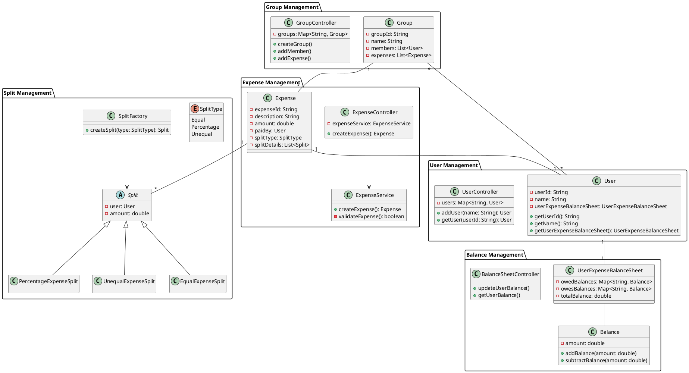

# Splitwise System Design

A Low Level Design implementation of the Splitwise expense sharing application.

## System Requirements

### Core Features
1. Users can register and create their profiles
2. Users can create groups for expense sharing
3. Users can add expenses with different split types:
   - Equal Split
   - Percentage Split
   - Unequal Split
4. System maintains balances for each user
5. Users can check their total balance and individual balances with other users

## Architecture

### Class Diagram


## Components

### 1. User Management
- Handles user registration and profile management
- Maintains user information and their relationships
- Components: User, UserController

### 2. Expense Management
- Manages expense creation and validation
- Handles different types of expenses
- Components: Expense, ExpenseController, ExpenseService

### 3. Split Management
- Implements different splitting strategies
- Provides factory pattern for split creation
- Components: Split (abstract), EqualExpenseSplit, PercentageExpenseSplit, UnequalExpenseSplit, SplitFactory

### 4. Balance Management
- Tracks user balances
- Maintains individual and overall balance sheets
- Components: Balance, UserExpenseBalanceSheet, BalanceSheetController

### 5. Group Management
- Handles group creation and member management
- Manages group expenses
- Components: Group, GroupController

## Design Patterns Used

1. **Factory Pattern**
   - Used in SplitFactory for creating different types of splits
   - Encapsulates split creation logic

2. **Controller Pattern**
   - Separates business logic from request handling
   - Used in UserController, ExpenseController, GroupController

3. **Singleton Pattern**
   - Applied to controllers to maintain single instances

4. **Strategy Pattern**
   - Different split strategies implement common Split interface
   - Allows runtime selection of split calculation method

## Data Flow

1. User Registration
   ```
   Client -> UserController -> User Creation -> UserExpenseBalanceSheet initialization
   ```

2. Expense Creation
   ```
   Client -> ExpenseController -> ExpenseService -> SplitFactory -> Balance Updates
   ```

3. Balance Settlement
   ```
   ExpenseService -> BalanceSheetController -> UserExpenseBalanceSheet Update
   ```

## How to Use

### Adding Users
```java
UserController userController = new UserController();
User user1 = userController.addUser("Alice");
User user2 = userController.addUser("Bob");
```

### Creating Groups
```java
GroupController groupController = new GroupController();
Group group = groupController.createGroup("Trip to Paris", List.of(user1, user2));
```

### Adding Expenses
```java
ExpenseController expenseController = new ExpenseController();
Expense expense = expenseController.createExpense(
    100.0,
    user1,
    "Dinner",
    SplitType.Equal,
    List.of(user1, user2)
);
```

## Error Handling

The system implements robust error handling for:
- Invalid split amounts
- User not found scenarios
- Invalid expense validation
- Negative amounts
- Group member validation

## Future Enhancements

1. Transaction History
2. Expense Categories
3. Currency Support
4. Simplified Debt Chains
5. Payment Integration
6. Activity Feed
7. Export Functionality
